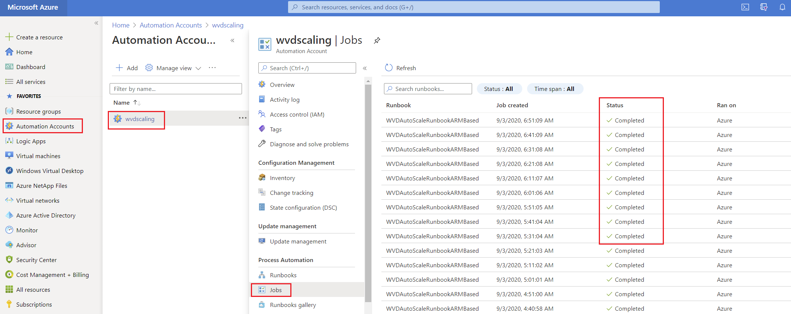
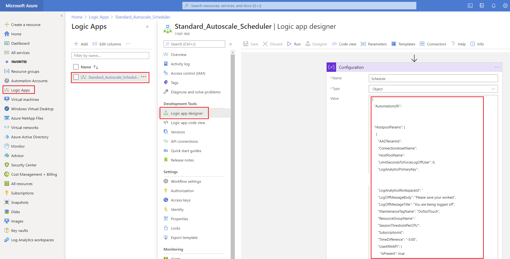

# WVD Daily Scaling Tool

## Overview

This tool expands on the existing Windows Virtual Desktop scaling tool by enabling the following functionality: 

- Define peak and off hours based on the day of the week
- Define minimum number of running session hosts for peak and off hours as well as the day of the week and 

## Prerequisites

This tool relies on components that are deployed by the existing Windows Virtual Desktop scaling tool. Therefore, the scaling tool must be deployed as a prerequisite before proceeding. You may find step-by-step documentation on deploying the existing scaling tool at the following URL: 

- https://docs.microsoft.com/en-us/azure/virtual-desktop/set-up-scaling-script


## Validate Prerequistes

Before proceeding, we must first ensure the exisitng scaling tool has been deployed properly and is function as expected. 

1. Navigate the the Logic App that is deployed by the existing scaling tool and confirm that there are successful runs.
   
    

1. Navigate to the Automation Account that is deployed by the existing scaling tool and confirm that there are successful job completions for the WVDAutoScaleRunbookARMBased Runbook.

    

1. Click on the latest WVDAutoScaleRunbookARMBased job, then click on Output to verify the Output of a recent WVDAutoScaleRunbookARMBased job to validate the jobs are running as expected.

    

## Prepare Logic App

1. Navigate to the existing Logic App, click on **Logic App Designer**, expand the HTTP request and copy the contents of the URI field into a text editor. Next, the **all** of the contents of the HTTP request body into a different text editor window. 

    

    <br />

    ---
    **IMPORTANT**

    You may always revert to a previous version of the Logic App by clicking on **Versions** within the Logic App blade, finding the appropriate version, and clicking **Promote**.

    

    ---
  
    <br />

1. Navigate to the **Logic app code view**, click within the coding window and press **Ctrl + A** on your keyboard to select all contents. Next, press **Delete** to clear out the existing Logic App configuration.

    

1. Copy the contents below and paste them into the Logic App code view.

    ```json
        {
            "definition": {
                "$schema": "https://schema.management.azure.com/providers/Microsoft.Logic/schemas/2016-06-01/workflowdefinition.json#",
                "actions": {
                    "Configuration": {
                        "inputs": {
                            "variables": [
                                {
                                    "name": "Schedule",
                                    "type": "object",
                                    "value": {
                                        "AutomationURI": "<Your Azure Automation URI>",
                                        "HostpoolParams": [
                                            {
                                                "AADTenantId": "<Your AAD Tenant ID>",
                                                "ConnectionAssetName": "AzureRunAsConnection",
                                                "HostPoolName": "<Your Hostpool Name>",
                                                "LimitSecondsToForceLogOffUser": "<Number of Seconds before Log Off>",
                                                "LogAnalyticsPrimaryKey": "<Your Log Analytics Primary Key>",
                                                "LogAnalyticsWorkspaceId": "<Your Log Analtics Workspace ID>",
                                                "LogOffMessageBody": "Please save your worked",
                                                "LogOffMessageTitle": "You are being logged off",
                                                "MaintenanceTagName": "DoNotTouch",
                                                "ResourceGroupName": "<Your Hostpool Resource Group Name>",
                                                "SessionThresholdPerCPU": "<Number of Concurrent Sessions per CPU Core>",
                                                "SubscriptionId": "<Your Azure Subscription ID>",
                                                "TimeDifference": "<Your Timezone Difference vs UTC",
                                                "UseARMAPI": {
                                                    "IsPresent": true
                                                }
                                            }
                                        ],
                                        "Schedule": [
                                            {
                                                "Day": "Sunday",
                                                "MinimumHostsOffHours": 1,
                                                "MinimumHostsPeakHours": 2,
                                                "PeakEnd": "18:00",
                                                "PeakStart": "8:00"
                                            },
                                            {
                                                "Day": "Monday",
                                                "MinimumHostsOffHours": 1,
                                                "MinimumHostsPeakHours": 2,
                                                "PeakEnd": "18:00",
                                                "PeakStart": "8:00"
                                            },
                                            {
                                                "Day": "Tuesday",
                                                "MinimumHostsOffHours": 1,
                                                "MinimumHostsPeakHours": 2,
                                                "PeakEnd": "18:00",
                                                "PeakStart": "8:00"
                                            },
                                            {
                                                "Day": "Wednesday",
                                                "MinimumHostsOffHours": 1,
                                                "MinimumHostsPeakHours": 2,
                                                "PeakEnd": "18:00",
                                                "PeakStart": "8:00"
                                            },
                                            {
                                                "Day": "Thursday",
                                                "MinimumHostsOffHours": 1,
                                                "MinimumHostsPeakHours": 2,
                                                "PeakEnd": "18:00",
                                                "PeakStart": "8:00"
                                            },
                                            {
                                                "Day": "Friday",
                                                "MinimumHostsOffHours": 1,
                                                "MinimumHostsPeakHours": 2,
                                                "PeakEnd": "18:00",
                                                "PeakStart": "8:00"
                                            },
                                            {
                                                "Day": "Saturday",
                                                "MinimumHostsOffHours": 1,
                                                "MinimumHostsPeakHours": 2,
                                                "PeakEnd": "18:00",
                                                "PeakStart": "8:00"
                                            }
                                        ],
                                        "Timezone": "Central Standard Time"
                                    }
                                }
                            ]
                        },
                        "runAfter": {},
                        "type": "InitializeVariable"
                    },
                    "Get_Config_Variables": {
                        "inputs": {
                            "variables": [
                                {
                                    "name": "ConfigBodyValue",
                                    "type": "string",
                                    "value": "@{substring(substring(string(first(body('Parse_Through_Configuration')?['HostpoolParams'])),1,sub(length(string(first(body('Parse_Through_Configuration')?['HostpoolParams']))),1)),0,sub(length(substring(string(first(body('Parse_Through_Configuration')?['HostpoolParams'])),1,sub(length(string(first(body('Parse_Through_Configuration')?['HostpoolParams']))),1))),1))}"
                                }
                            ]
                        },
                        "runAfter": {
                            "Parse_Through_Configuration": [
                                "Succeeded"
                            ]
                        },
                        "type": "InitializeVariable"
                    },
                    "Get_Parameters_for_Current_Day_of_Week": {
                        "inputs": {
                            "from": "@body('Parse_Through_Configuration')?['Schedule']",
                            "where": "@equals(item()?['Day'], formatDateTime(variables('Today'), 'dddd'))"
                        },
                        "runAfter": {
                            "Set_Current_Datetime": [
                                "Succeeded"
                            ]
                        },
                        "type": "Query"
                    },
                    "HTTP": {
                        "inputs": {
                            "body": "@variables('ConfigBody')",
                            "method": "POST",
                            "uri": "@{body('Parse_Through_Configuration')?['AutomationURI']}"
                        },
                        "runAfter": {
                            "If_During_Peak_Hours": [
                                "Succeeded"
                            ]
                        },
                        "runtimeConfiguration": {
                            "staticResult": {
                                "name": "HTTP0",
                                "staticResultOptions": "Disabled"
                            }
                        },
                        "type": "Http"
                    },
                    "If_During_Peak_Hours": {
                        "actions": {
                            "Set_Config_Body_for_Peak_Hours": {
                                "inputs": {
                                    "name": "ConfigBody",
                                    "value": "{ \"BeginPeakTime\": \"@{variables('StartTime')}\",  \"EndPeakTime\": \"@{variables('EndTime')}\",   \"MinimumNumberOfRDSH\": @{last(body('Get_Parameters_for_Current_Day_of_Week'))?['MinimumHostsPeakHours']},  @{variables('ConfigBodyValue')} }"
                                },
                                "runAfter": {},
                                "type": "SetVariable"
                            }
                        },
                        "else": {
                            "actions": {
                                "Set_Config_Body_for_Off_Hours": {
                                    "inputs": {
                                        "name": "ConfigBody",
                                        "value": "{ \"BeginPeakTime\": \"@{variables('StartTime')}\",  \"EndPeakTime\": \"@{variables('EndTime')}\",   \"MinimumNumberOfRDSH\": @{last(body('Get_Parameters_for_Current_Day_of_Week'))?['MinimumHostsOffHours']},  @{variables('ConfigBodyValue')} }"
                                    },
                                    "runAfter": {},
                                    "type": "SetVariable"
                                }
                            }
                        },
                        "expression": {
                            "and": [
                                {
                                    "greaterOrEquals": [
                                        "@formatDateTime(variables('Today'),'yyyy-MM-ddTHH:mm')",
                                        "@formatDateTime(variables('StartDate'),'yyyy-MM-ddTHH:mm')"
                                    ]
                                },
                                {
                                    "lessOrEquals": [
                                        "@formatDateTime(variables('Today'),'yyyy-MM-ddTHH:mm')",
                                        "@formatDateTime(variables('EndDate'),'yyyy-MM-ddTHH:mm')"
                                    ]
                                }
                            ]
                        },
                        "runAfter": {
                            "Set_End_Time_for_Today": [
                                "Succeeded"
                            ]
                        },
                        "type": "If"
                    },
                    "Initiate_Config_Body": {
                        "inputs": {
                            "variables": [
                                {
                                    "name": "ConfigBody",
                                    "type": "string",
                                    "value": "\n\n"
                                }
                            ]
                        },
                        "runAfter": {
                            "Get_Config_Variables": [
                                "Succeeded"
                            ]
                        },
                        "type": "InitializeVariable"
                    },
                    "Parse_Through_Configuration": {
                        "inputs": {
                            "content": "@variables('Schedule')",
                            "schema": {
                                "properties": {
                                    "AutomationURI": {
                                        "type": "string"
                                    },
                                    "HostpoolParams": {
                                        "items": {
                                            "properties": {
                                                "AADTenantId": {
                                                    "type": "string"
                                                },
                                                "ConnectionAssetName": {
                                                    "type": "string"
                                                },
                                                "HostPoolName": {
                                                    "type": "string"
                                                },
                                                "LimitSecondsToForceLogOffUser": {
                                                    "type": "integer"
                                                },
                                                "LogAnalyticsPrimaryKey": {
                                                    "type": "string"
                                                },
                                                "LogAnalyticsWorkspaceId": {
                                                    "type": "string"
                                                },
                                                "LogOffMessageBody": {
                                                    "type": "string"
                                                },
                                                "LogOffMessageTitle": {
                                                    "type": "string"
                                                },
                                                "MaintenanceTagName": {
                                                    "type": "string"
                                                },
                                                "ResourceGroupName": {
                                                    "type": "string"
                                                },
                                                "SessionThresholdPerCPU": {
                                                    "type": "number"
                                                },
                                                "SubscriptionId": {
                                                    "type": "string"
                                                },
                                                "TimeDifference": {
                                                    "type": "string"
                                                },
                                                "UseARMAPI": {
                                                    "properties": {
                                                        "IsPresent": {
                                                            "type": "boolean"
                                                        }
                                                    },
                                                    "type": "object"
                                                }
                                            },
                                            "required": [
                                                "AADTenantId",
                                                "SubscriptionId",
                                                "ConnectionAssetName",
                                                "HostPoolName",
                                                "ResourceGroupName",
                                                "LogAnalyticsPrimaryKey",
                                                "LogAnalyticsWorkspaceId",
                                                "LimitSecondsToForceLogOffUser",
                                                "LogOffMessageBody",
                                                "LogOffMessageTitle",
                                                "MaintenanceTagName",
                                                "SessionThresholdPerCPU",
                                                "TimeDifference",
                                                "UseARMAPI"
                                            ],
                                            "type": "object"
                                        },
                                        "type": "array"
                                    },
                                    "Schedule": {
                                        "items": {
                                            "properties": {
                                                "Day": {
                                                    "type": "string"
                                                },
                                                "MinimumHostsOffHours": {
                                                    "type": "integer"
                                                },
                                                "MinimumHostsPeakHours": {
                                                    "type": "integer"
                                                },
                                                "PeakEnd": {
                                                    "type": "string"
                                                },
                                                "PeakStart": {
                                                    "type": "string"
                                                }
                                            },
                                            "required": [
                                                "Day",
                                                "PeakStart",
                                                "PeakEnd",
                                                "MinimumHostsPeakHours",
                                                "MinimumHostsOffHours"
                                            ],
                                            "type": "object"
                                        },
                                        "type": "array"
                                    },
                                    "Timezone": {
                                        "type": "string"
                                    }
                                },
                                "type": "object"
                            }
                        },
                        "runAfter": {
                            "Configuration": [
                                "Succeeded"
                            ]
                        },
                        "type": "ParseJson"
                    },
                    "Set_Current_Datetime": {
                        "inputs": {
                            "variables": [
                                {
                                    "name": "Today",
                                    "type": "string",
                                    "value": "@{convertFromUtc(utcNow(), body('Parse_Through_Configuration')?['Timezone'])}"
                                }
                            ]
                        },
                        "runAfter": {
                            "Initiate_Config_Body": [
                                "Succeeded"
                            ]
                        },
                        "type": "InitializeVariable"
                    },
                    "Set_EndTime": {
                        "inputs": {
                            "variables": [
                                {
                                    "name": "EndTime",
                                    "type": "string",
                                    "value": "@{last(body('Get_Parameters_for_Current_Day_of_Week'))?['PeakEnd']}"
                                }
                            ]
                        },
                        "runAfter": {
                            "Set_StartTime": [
                                "Succeeded"
                            ]
                        },
                        "type": "InitializeVariable"
                    },
                    "Set_End_Time_for_Today": {
                        "inputs": {
                            "variables": [
                                {
                                    "name": "EndDate",
                                    "type": "string",
                                    "value": "@{concat(formatDateTime(variables('Today'), 'yyyy-MM-dd'),' ',variables('EndTime'))}"
                                }
                            ]
                        },
                        "runAfter": {
                            "Set_Start_Time_for_Today": [
                                "Succeeded"
                            ]
                        },
                        "type": "InitializeVariable"
                    },
                    "Set_StartTime": {
                        "inputs": {
                            "variables": [
                                {
                                    "name": "StartTime",
                                    "type": "string",
                                    "value": "@{last(body('Get_Parameters_for_Current_Day_of_Week'))?['PeakStart']}"
                                }
                            ]
                        },
                        "runAfter": {
                            "Get_Parameters_for_Current_Day_of_Week": [
                                "Succeeded"
                            ]
                        },
                        "type": "InitializeVariable"
                    },
                    "Set_Start_Time_for_Today": {
                        "inputs": {
                            "variables": [
                                {
                                    "name": "StartDate",
                                    "type": "string",
                                    "value": "@{concat(formatDateTime(variables('Today'), 'yyyy-MM-dd'),' ',variables('StartTime'))}"
                                }
                            ]
                        },
                        "runAfter": {
                            "Set_EndTime": [
                                "Succeeded"
                            ]
                        },
                        "type": "InitializeVariable"
                    }
                },
                "contentVersion": "1.0.0.0",
                "outputs": {},
                "parameters": {},
                "staticResults": {
                    "HTTP0": {
                        "outputs": {
                            "headers": {},
                            "statusCode": "OK"
                        },
                        "status": "Succeeded"
                    }
                },
                "triggers": {
                    "Recurrence": {
                        "recurrence": {
                            "frequency": "Minute",
                            "interval": 10
                        },
                        "type": "Recurrence"
                    }
                }
            },
            "parameters": {}
        }
    ```
1. Click on the **Logic app designer** link and expand the **Recurrence** step, set the time interval to match your needs. 
   
    

1. Expand the **Configuration** step. Copy each parameter individually from your text editor into the corresponding parameter in the new configuration step for each of the following parameters:

   - AutomationURI
   - AADTenantId
   - ConnectionAssetName
   - HostPoolName
   - LimitSecondsToForceLogOffUser
   - LogAnalyticsPrimaryKey
   - LogAnalyticsWorkspaceId
   - LogOffMessageBody
   - LogOffMessageTitle
   - MaintenanceTagName
   - ResourceGroupName
   - SessionThresholdPerCPU
   - SubscriptionId
   - TimeDifference
   - Timezone

    

1. For each of the seven days of the week, specify the following: 

    Parameter | Description
    ------------ | -------------
    MinimumHostsOffHours | Minimum number of session hosts to be running during **Off Hours.**
    MinimumHostsPeakHours | Minimum number of session hosts to be running during **Peak Hours.**
    PeakEnd | 24 hour time at which **Peak Hours** end (e.g. 08:00, 13:00)
    PeakStart | 24 hour time at which **Peak Hours** being (e.g. 08:00, 13:00)  

    <br />

      

    <br />

    ---
    **IMPORTANT**

    Do not adjust any of the **Day** values as it will cause the scaling tool to not function for that day.
        
    ---
  
    <br />

1. Save the Logic App and verify it is functioning as expected for the appropriate date and window of time (peak vs off hours) by ensuring there are successful Logic App and Automation Account job runs.     

    If you find that the Logic App isn't behaving as expected, you may always revert to a previous version of the Logic App by clicking on **Versions** within the Logic App blade, finding the appropriate version, and clicking **Promote**.

    