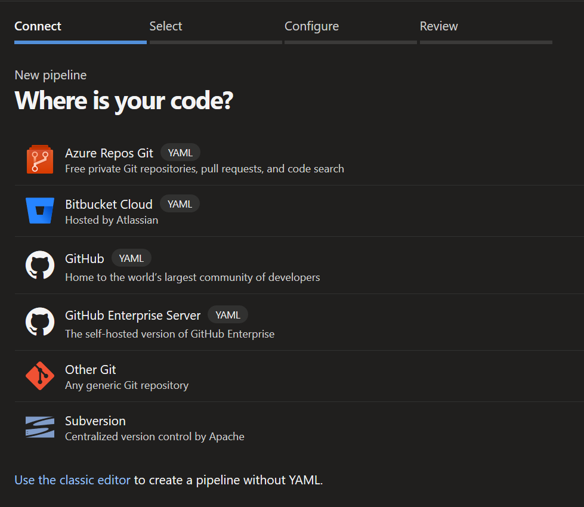
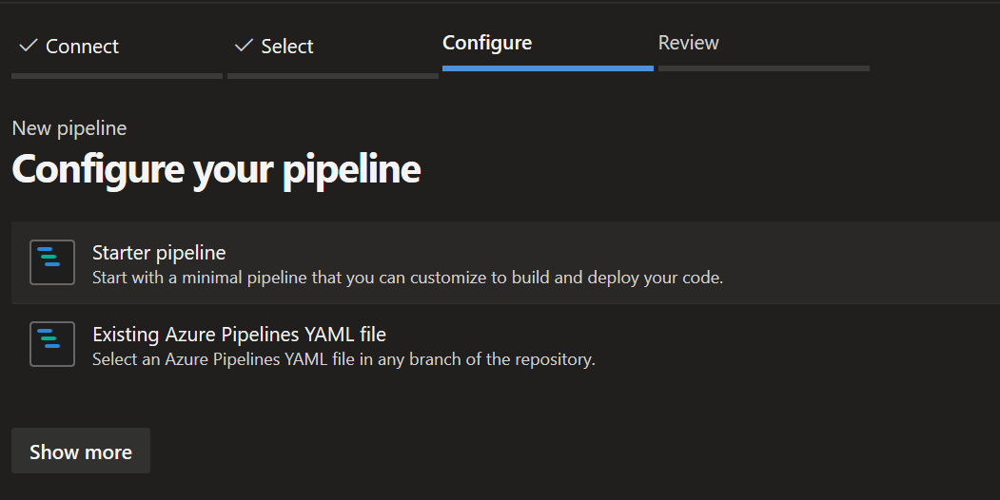
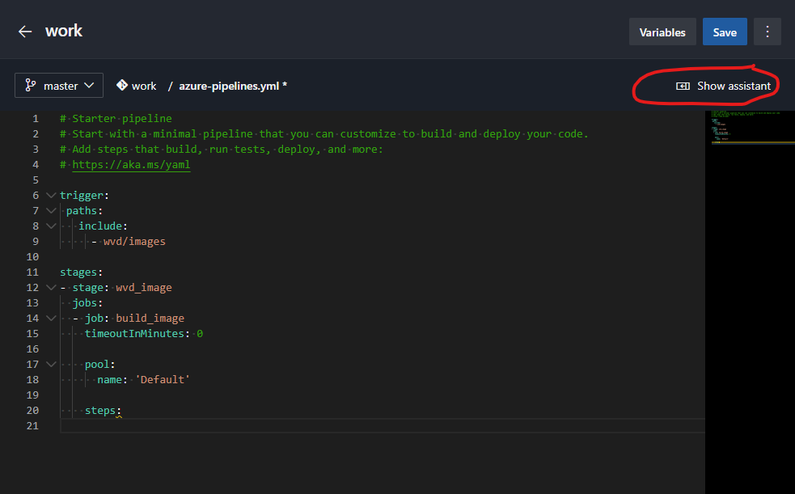
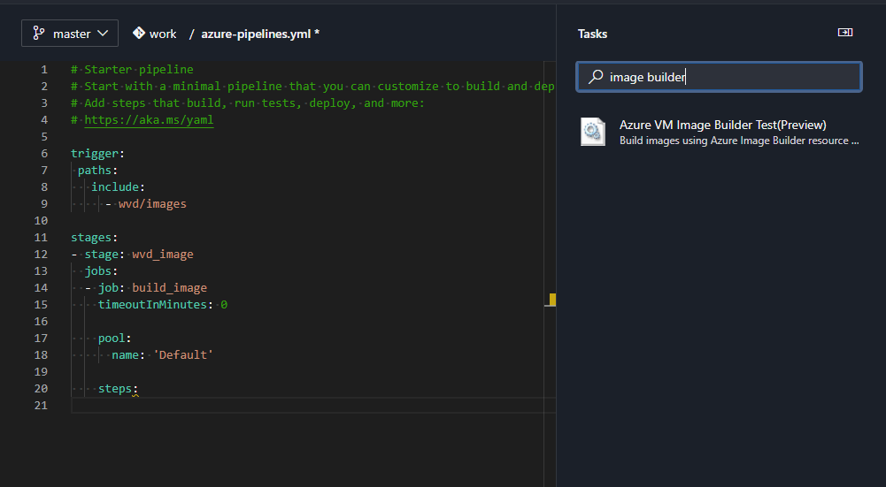
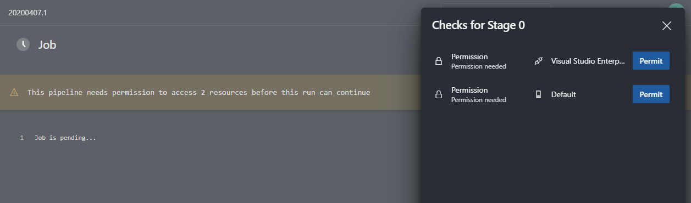
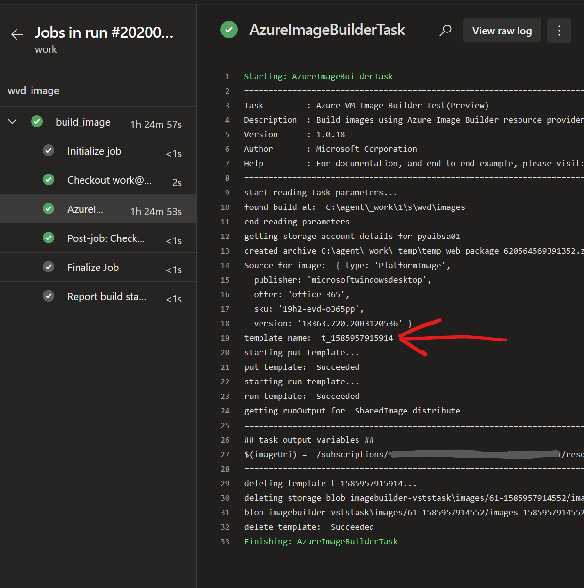
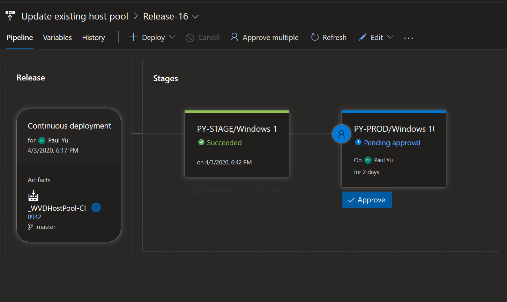

# Image Management using Azure Image Builder, Shared Image Gallery, Azure DevOps

**References:**

- https://docs.microsoft.com/en-us/azure/virtual-machines/windows/shared-image-galleries
- https://docs.microsoft.com/en-us/azure/virtual-machines/windows/image-builder-gallery
- https://github.com/danielsollondon/azvmimagebuilder
- https://github.com/pauldotyu/RDS-Templates

**To achieve automation of common WVD management tasks the following components will be used:**

- Azure DevOps (Repos, Pipelines, AIB Image Builder Task)
- Azure Image Builder
- Azure Shared Image Gallery
- Azure Storage

## High-level Process

1. Engineer maintains PowerShell script for customizing images and commits to git repo
1. Build pipeline listens for pushes made to the git repo and triggers a pipeline execution to build/customize a new image using Azure Image Builder
1. New image is distributed to Shared Image Gallery and optionally replicated to regions
1. New Shared Image Gallery image version will be used as the VM source and deploy to staging host pool
1. Staging host pool deployment completes and arrives at approval gate
1. Production host pool deployment is approved and deployed

## Prerequisites

- Enable Azure Image Builder feature in your Azure subscription
- Create a Shared Image Gallery and Image Definition in Azure
- Create an Azure DevOps organization/project
- Add Azure Image Builder Task from Azure DevOps marketplace to your organization

## Enable Azure Image Builder

> PowerShell used here to keep consistent with WVD tooling. CLI equivalent commands can be found [here](https://docs.microsoft.com/en-us/azure/virtual-machines/windows/image-builder)

Execute the following command to enable the preview feature

```powershell
Register-AzProviderFeature -ProviderNamespace Microsoft.VirtualMachineImages -FeatureName VirtualMachineTemplatePreview
```

Check the status of the feature

```powershell
Get-AzProviderFeature -ProviderNamespace Microsoft.VirtualMachineImages -FeatureName VirtualMachineTemplatePreview
```

While you're at it, make sure the following resource providers are also registered:

```powershell
Get-AzResourceProvider -ProviderNamespace Microsoft.VirtualMachineImages | Select-Object Locations,  RegistrationState
Get-AzResourceProvider -ProviderNamespace Microsoft.Storage | Select-Object Locations, RegistrationState
```

If the resource providers listed above are not enabled, make sure these are enabled too

```powershell
Register-AzResourceProvider -ProviderNamespace Microsoft.VirtualMachineImages
Register-AzResourceProvider -ProviderNamespace Microsoft.Storage
```

When you registered the VirtualMachineTemplatePreview feature, it added the AIB identity in your tenant. You will need to then create a resource group and grant the AIB identity the contributor role on your new resource group

> The ApplicationId for AIB is static

```powershell
$ResourceGroup = "<YOUR-RESOURCE-GROUP-NAME>"
$Location = "<LOCATION>"
New-AzResourceGroup -Name $ResourceGroup -Location $Location
New-AzRoleAssignment -RoleDefinitionName "Contributor" -ApplicationId "cf32a0cc-373c-47c9-9156-0db11f6a6dfc" -ResourceGroupName $ResourceGroup
```

## Create an Azure Storage account

> Create a storage account in the same resource group that AIB will be working out of

Use this [guide](https://docs.microsoft.com/en-us/azure/storage/common/storage-account-create?tabs=azure-portal) (if needed) to create the storage account

## Create a Shared Image Gallery and Image Definition

> NOTE: Your Shared Image Gallery should be deployed in an AIB [supported regions](https://docs.microsoft.com/en-us/azure/virtual-machines/windows/image-builder-overview#regions)

The steps below are also documented [here](https://docs.microsoft.com/en-us/azure/virtual-machines/windows/shared-images#create-an-image-gallery)

Create image gallery

```powershell
$gallery = New-AzGallery `
  -GalleryName "<YOUR_GALLERY_NAME> `
  -ResourceGroupName $ResourceGroup.ResourceGroupName `
  -Location $resourceGroup.Location `
  -Description "<YOUR_GALLERY_DESCRIPTION>"
```

Create image definition

```powershell
$galleryImage = New-AzGalleryImageDefinition `
  -GalleryName $gallery.Name `
  -ResourceGroupName $ResourceGroup.ResourceGroupName `
  -Location $gallery.Location `
  -Name "<YOUR_IMAGE_NAME" `
  -OsState generalized `
  -OsType Windows `
  -Publisher "<YOUR_PUBLISHER_NAME>" `
  -Offer "<YOUR_OFFER_NAME>" `
  -Sku "<YOUR_SKU>"
```

## Prepare your image build script

This is your image so you will need to know what applications are to be installed, how to silently install them and which registry settings you'd like to implement to make for a good user experience in addition to maintaining security posture.

Some good examples to start:

- https://github.com/markhooks81/Winter-Ready-2020/blob/master/WVDGoldImageAIB.ps1
- https://github.com/whitscripts/rds/blob/master/WVD_MasterImage_Prep_Script-public.ps1

The idea is that this script will be committed to a git repo and used to customize base  images preferrably pulled from the marketplace to ensure we're always using the latest version. The Azure DevOps Image Builder task also includes the ability to perform Windows updates as part of the image building process.

## OPTIONAL: Get started with Azure DevOps

- [Create a new organization](https://docs.microsoft.com/en-us/azure/devops/organizations/accounts/create-organization?view=azure-devops)
- [Create a new project](https://docs.microsoft.com/en-us/azure/devops/organizations/projects/create-project?view=azure-devops&tabs=preview-page)
- [Create a new Git repo in your project and clone locally](https://docs.microsoft.com/en-us/azure/devops/repos/git/create-new-repo?toc=%2Fazure%2Fdevops%2Forganizations%2Ftoc.json&bc=%2Fazure%2Fdevops%2Forganizations%2Fbreadcrumb%2Ftoc.json&view=azure-devops)
- [Video: Git version control in VS Code](https://code.visualstudio.com/docs/introvideos/versioncontrol)
- A very basic install script can be found [here](files/base-installs.ps1)

## Azure DevOps Pipeline

If you have a lengthy build script, you will need to either purchase additional capacity or self-host a build agent. Microsoft hosted agents will timeout after 60 minutes for private repos. Here is a link to help you get started with Self-Hosted Agents

- [Install self-hosted agents](https://docs.microsoft.com/en-us/azure/devops/pipelines/agents/agents?view=azure-devops&tabs=browser#install)

Be sure that your DevOps project has a service connection to your Azure subscription

- [Create an Azure Resource Manager service connection](https://docs.microsoft.com/en-us/azure/devops/pipelines/library/connect-to-azure?view=azure-devops#create-an-azure-resource-manager-service-connection-using-automated-security)

Add the Azure VM Image Builder DevOps Task to your organization

- [Azure VM Image Builder DevOps Task](https://marketplace.visualstudio.com/items?itemName=AzureImageBuilder.devOps-task-for-azure-image-builder)

In Azure DevOps, navigate to **Pipeline** and click **New pipeline**
> We'll use the new YAML schema. This can also be done using the classic editor but used YAML so that we can use the Windows 10 Multi-session with Office 365 ProPlus image from the gallery as our base

Select your Git repo



Select your repository

Select starter pipeline



In the starter pipeline, delete the sample yaml, replace with the following code then place your cursor directly under ``steps:``, then click the **Show assistant** button

```yaml
trigger: 
  master

stages:
- stage: wvd_image
  jobs:
  - job: build_image
    timeoutInMinutes: 0

    pool:
      name: 'Default'

    steps:
 ```



> This will make dealing with YAML much easier

In the search box, type "image builder" you should see the task appear



Click the task and fill in the following properties:

- Azure Subscription: select the subscription where you enabled the AIB feature
- Resource group: select your resource group where you added contributor access for AIB
- Location: select a AIB [supported regions](https://docs.microsoft.com/en-us/azure/virtual-machines/windows/image-builder-overview#regions)
- Source
  - Image type: Marketplace
  - Base image: Windows 19h1-Evd **(NOTE: The drop down does not include the image I'm looking for but can specify the exact SKU by overwritting the YAML)**
  - Base Image version: latest
- Customize
  - Provisioner: PowerShell
  - Run Windows Update as last customization: checked
  - Build path: the path to your script in your repo (relative to root of the repo directory)
  - Inline customization script: & 'c:\buildartifacts\path_to_your_script\your_script.ps1'
  - Storage account: your storage account
- Distribute
  - Distribute type: Shared Image Gallery
  - Image id for Shared Gallery Image: resource id of the image definition
  - Regions separated by comma: replication regions - no need to enter the AIB region
- Optional Settings
  - VM Size: Standard_DS4_v2

Sample YAML which uses a self-hosted agent pool:

> Set the timeoutInMinutes value to 0 so that it can run for as long as needed from your local build agent

```yaml
trigger:
- master
stages:
- stage: wvd_image
  jobs:
  - job: build_image
    timeoutInMinutes: 0

    pool:
    name: 'Default'

    steps:
    - task: AzureImageBuilderTask@1
      inputs:
        imageSource: 'marketplace'
        baseImage: 'microsoftwindowsdesktop:office-365:19h2-evd-o365pp:windows'
        provisioner: 'powershell'
        windowsUpdateProvisioner: true
        packagePath: 'wvd/images'
        inlineScript: '& ''c:\buildartifacts\images\scripts\base-installs.ps1'''
        storageAccountName: <YOUR_STORAGE_ACCOUNT_NAME>
        distributeType: 'sig'
        galleryImageId: '/subscriptions/<YOUR_SUBSCRIPTION_ID>/resourceGroups/<YOUR_RESOURCE_GROUP_NAME>/providers/Microsoft.Compute/galleries/<YOUR_SHARED_IMAGE_GALLERY_NAME>/images/<YOUR_IMAGE_DEFINITION_NAME>'
        replicationRegions: 'centralus'
        ibSubscription:  '<YOUR_AZURE_SERVICE_CONNECTION_NAME>'
        ibAzureResourceGroup: '<YOUR_RESOURCE_GROUP_NAME>'
        ibLocation: '<YOUR_AIB_LOCATOIN>'
        vmSize: 'Standard_DS4_v2'
```

If you are running this for the first time, you will need to grant the pipeline job permissions to use your Azure Subscription connection and self-hosted build agent. Click the **Permit** button for both.



Once you submit the job, Azure DevOps will take AIB input parameters and submit a deployment template then run. The template name will be returned as part of the running logs and you can use the following CLI or PowerShell query to check the status. The template Id will start with **t_**



Take the task id and query for the build status

**PowerShell:**

```powershell
(Get-AzResource -ResourceGroupName <YOUR_RESOURCE_GROUP_NAME> -ResourceType Microsoft.VirtualMachineImages/imageTemplates -Name t_1585957915914).Properties.lastRunStatus
  ```

**CLI:**

```sh
az resource show -g <YOUR_RESOURCE_GROUP_NAME> -n t_1585957915914 --resource-type Microsoft.VirtualMachineImages/imageTemplates --query 'properties.lastRunStatus'
```

The job will eventually finish (mostly likely more than an hour later depending on build script, windows update, and replication regions) and you can setup email alerts to trigger upon failure or success.

Once it is finished you can view the latest version in your Shared Image Gallery.

## Azure DevOps Releases

Now, that your image is updated, you are ready to update your host pool. You can use the following templates which have been modified to deploy from Shared Image Galleries:

- [Create host pool using image from SIG](https://raw.githubusercontent.com/pauldotyu/RDS-Templates/master/wvd-templates/Create%20and%20provision%20WVD%20host%20pool/mainTemplate.json)

- [Update host pool usnig image from SIG](https://raw.githubusercontent.com/pauldotyu/RDS-Templates/master/wvd-templates/Update%20existing%20WVD%20host%20pool/mainTemplate.json)

Using the templates above, you can build a release pipeline that triggers off of a build completion and use the Azure Deployment task to update your host pool or create new ones. You can also add stages to the pipeline so that a Stage tenant is automatically deployed for testing while production awaits for approval to proceed.



You should source control the hostpool templates and chain pipeline builds together to automate the workflow.

As an example:

- The image build pipeline completes and triggers a hostpool pipeline
- The hostpool pipeline will take my ARM template JSON files and publish as build artifacts
  - As part of the hostpool pipeline options, I can format the build number to be ``$(DayOfYear)$(Rev:r)`` so that my build numbers are short and unique. In the screen shot above, my build number is **0942** which represents the 94th day of the year and the second build of the day. This will be used in a later pipeline.
- The hostpool pipeline completes and triggers the **Update existing host pool** to push my new image to an existing hostpool by submitting the ARM template and updating its parameter using Azure DevOps Pipeline Variables. 
  - Using variables we can update the host pool VM name prefix to our build number so we'll easily be able to identify the day of the year that the image was built.
