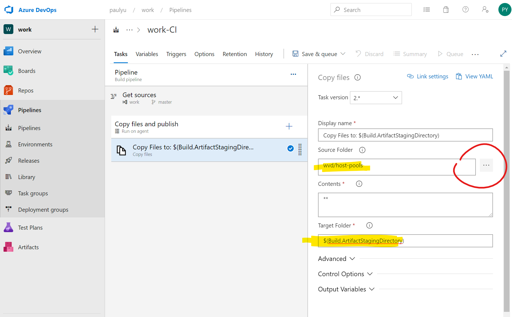
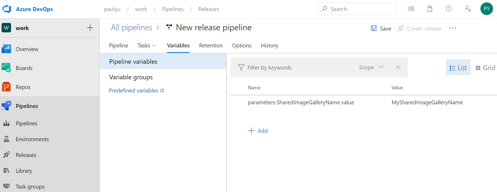
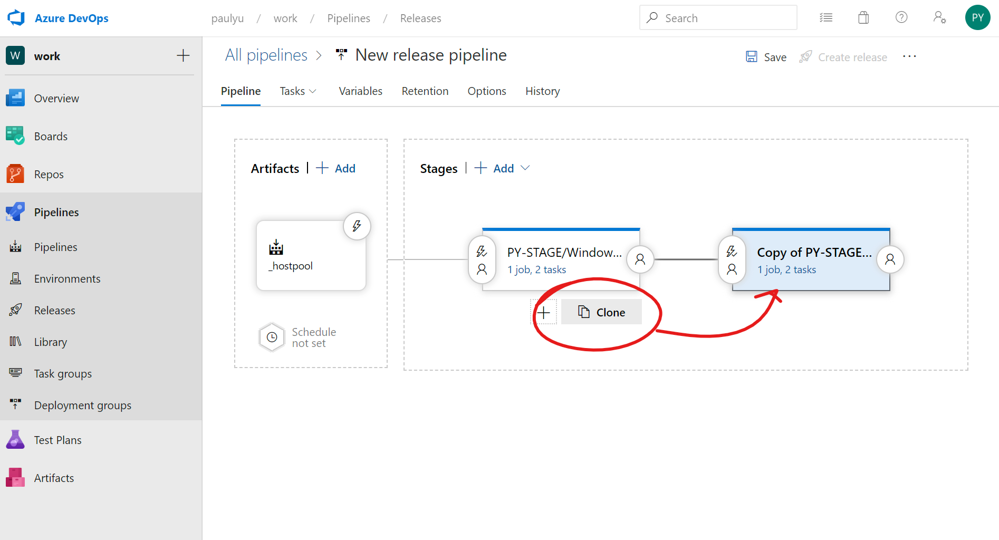

# Image Management using Azure Image Builder, Shared Image Gallery, Azure DevOps

**References:**

- https://docs.microsoft.com/en-us/azure/virtual-machines/windows/shared-image-galleries
- https://docs.microsoft.com/en-us/azure/virtual-machines/windows/image-builder-gallery
- https://github.com/danielsollondon/azvmimagebuilder
- https://github.com/markhooks81/Winter-Ready-2020/
- https://github.com/whitscripts/wvd/
- https://github.com/pauldotyu/RDS-Templates

**To achieve automation of common WVD management tasks the following components will be used:**

- Azure DevOps (Repos, Pipelines, AIB Image Builder Task)
- Azure Image Builder
- Azure Shared Image Gallery
- Azure Storage

## High-level Process


- Engineer maintains PowerShell script for customizing images and commits to git repo
- Build pipeline listens for pushes made to the git repo and triggers a pipeline execution to build/customize a new image using Azure Image Builder
- Image builder pulls from image source, customizes image using PowerShell script, and optionally applies Windows updates
- New image is distributed to Shared Image Gallery and optionally replicated to regions. New Shared Image Gallery image version will be used as the VM source and deploy to staging host pool
- Upon completion of image build process, host pool pipline kicks off to push ARM templates as build artificats and triggers a release deployment to deploy new image into staging environment
- Staging host pool deployment completes and arrives at approval gate
- Production host pool deployment is approved and deployed

## Prerequisites

- Enable Azure Image Builder feature in your Azure subscription
- Create a Shared Image Gallery and Image Definition in Azure
- Create an Azure DevOps organization/project
- Add Azure Image Builder Task from Azure DevOps marketplace to your organization

## Connect to your Azure account

```powershell
Connect-AzAccount
```

## If necessary, select the proper Azure Subscription

```powershell
Get-AzSubscription
Get-AzContext
Set-AzContext -SubscriptionId <YOUR_SUBSCRIPTION_ID>
```

## Enable Azure Image Builder

> PowerShell used here to keep consistent with WVD tooling. CLI equivalent commands can be found [here](https://docs.microsoft.com/en-us/azure/virtual-machines/windows/image-builder)

Execute the following command to enable the preview feature

```powershell
Register-AzProviderFeature -ProviderNamespace Microsoft.VirtualMachineImages -FeatureName VirtualMachineTemplatePreview
```

Check the status of the feature

```powershell
Get-AzProviderFeature -ProviderNamespace Microsoft.VirtualMachineImages -FeatureName VirtualMachineTemplatePreview
```

While you're at it, make sure the following resource providers are also registered:

```powershell
Get-AzResourceProvider -ProviderNamespace Microsoft.VirtualMachineImages | Select-Object Locations,  RegistrationState
Get-AzResourceProvider -ProviderNamespace Microsoft.Storage | Select-Object Locations, RegistrationState
```

If the resource providers listed above are not enabled, make sure these are enabled too

```powershell
Register-AzResourceProvider -ProviderNamespace Microsoft.VirtualMachineImages
Register-AzResourceProvider -ProviderNamespace Microsoft.Storage
```

## Create a user-assigned managed identity (new requirement as of 5/26/2020)

Use this [guide](https://docs.microsoft.com/en-us/azure/active-directory/managed-identities-azure-resources/how-to-manage-ua-identity-powershell) to create the managed identity

```powershell
# Get the prerelease version of PowerShellGet, you might have to exit and re-launch PowerShell
Install-Module -Name PowerShellGet -AllowPrerelease

# Install the prerelease version of the Az.ManagedServiceIdentity module
Install-Module -Name Az.ManagedServiceIdentity -AllowPrerelease

# Create a user-assigned managed identity
New-AzUserAssignedIdentity -ResourceGroupName "<YOUR-RESOURCE-GROUP-NAME>" -Name "<YOUR-USER-ASSIGNED-IDENTITY-NAME>"

# List user-assigned managed identities
Get-AzUserAssignedIdentity -ResourceGroupName "<YOUR-RESOURCE-GROUP-NAME>"
```

Your user-assigned managed identity will look like this. Copy to clipboard and keep it handy

``/subscriptions/xxxxxxxx-xxxx-xxxx-xxxx-xxxxxxxxxxxxx/resourcegroups/<YOUR-RESOURCE-GROUP-NAME>/providers/Microsoft.ManagedIdentity/userAssignedIdentities/<YOUR-USER-ASSIGNED-IDENTITY-NAME>``

Use this [guide](https://github.com/danielsollondon/azvmimagebuilder/blob/master/aibPermissions.md#azure-vm-image-builder-permissions-explained-and-requirements) to grant permissions

```powershell
$imageResourceGroup="<YOUR-RESOURCE-GROUP-NAME>"

# Get current subscription Id
$subscriptionId=(Get-AzContext).Subscription.Id

# Make role name unique, to avoid clashes in the same AAD Domain
$timeInt=$(get-date -UFormat "%s")
$imageRoleDefName="Azure Image Builder Service Image Creation Role "+$timeInt

# Get the user-identity properties
$idenityNameResourceId=$(Get-AzUserAssignedIdentity -ResourceGroupName "<YOUR-RESOURCE-GROUP-NAME>" -Name "<YOUR-USER-ASSIGNED-IDENTITY-NAME>").Id
$idenityNamePrincipalId=$(Get-AzUserAssignedIdentity -ResourceGroupName "<YOUR-RESOURCE-GROUP-NAME>" -Name "<YOUR-USER-ASSIGNED-IDENTITY-NAME>").PrincipalId

# Assign permissions for identity to distribute images. This command will download and update the custom role template
$aibRoleImageCreationUrl="https://raw.githubusercontent.com/danielsollondon/azvmimagebuilder/master/solutions/12_Creating_AIB_Security_Roles/aibRoleImageCreation.json"
$aibRoleImageCreationPath = "aibRoleImageCreation.json"

# Download config
Invoke-WebRequest -Uri $aibRoleImageCreationUrl -OutFile $aibRoleImageCreationPath -UseBasicParsing

# Update role definition template
((Get-Content -path $aibRoleImageCreationPath -Raw) -replace '<subscriptionID>',$subscriptionID) | Set-Content -Path $aibRoleImageCreationPath
((Get-Content -path $aibRoleImageCreationPath -Raw) -replace '<rgName>', $imageResourceGroup) | Set-Content -Path $aibRoleImageCreationPath

## Randomize the role definition name to make it unique for this example
((Get-Content -path $aibRoleImageCreationPath -Raw) -replace 'Azure Image Builder Service Image Creation Role', $imageRoleDefName) | Set-Content -Path $aibRoleImageCreationPath

# Create role definition
New-AzRoleDefinition -InputFile  ./aibRoleImageCreation.json

# Grant role definition to image builder service principal
New-AzRoleAssignment -ObjectId $idenityNamePrincipalId -RoleDefinitionName $imageRoleDefName -Scope "/subscriptions/$subscriptionID/resourceGroups/$imageResourceGroup"
```

> NOTE: If you see this error: 'New-AzRoleDefinition: Role definition limit exceeded. No more role definitions can be created.' See this article to resolve: https://docs.microsoft.com/en-us/azure/role-based-access-control/troubleshooting

## Create an Azure Storage account

> Use this [guide](https://docs.microsoft.com/en-us/azure/storage/common/storage-account-create?tabs=azure-portal) (if needed) to create the storage account.

Azure Image Builder will use this storage account to temporarily store files for the deployment template.

## Create a Shared Image Gallery and Image Definition

> NOTE: Your Shared Image Gallery should be deployed in an AIB [supported regions](https://docs.microsoft.com/en-us/azure/virtual-machines/windows/image-builder-overview#regions)

The steps below are also documented [here](https://docs.microsoft.com/en-us/azure/virtual-machines/windows/shared-images#create-an-image-gallery)

Create image gallery

```powershell
$gallery = New-AzGallery `
  -GalleryName <YOUR_GALLERY_NAME> `
  -ResourceGroupName $ResourceGroup.ResourceGroupName `
  -Location $resourceGroup.Location `
  -Description "<YOUR_GALLERY_DESCRIPTION>"
```

Create image definition

```powershell
$galleryImage = New-AzGalleryImageDefinition `
  -GalleryName $gallery.Name `
  -ResourceGroupName $ResourceGroup.ResourceGroupName `
  -Location $gallery.Location `
  -Name "<YOUR_IMAGE_NAME" `
  -OsState generalized `
  -OsType Windows `
  -Publisher "<YOUR_PUBLISHER_NAME>" `
  -Offer "<YOUR_OFFER_NAME>" `
  -Sku "<YOUR_SKU>"
```

## Prepare your image build script

This is where you customize your image. You should know what applications are to be installed, how to silently install them, and which registry settings you'd like to implement to make for a good user experience in addition to maintaining security posture.

Some good examples to start:

- https://github.com/markhooks81/Winter-Ready-2020/blob/master/WVDGoldImageAIB.ps1
- https://github.com/whitscripts/rds/blob/master/WVD_MasterImage_Prep_Script-public.ps1


The idea is that this script will be committed to a git repo and used to customize base  images. Pulling base images from the marketplace will ensure you're always using the latest version. 

The Azure DevOps Image Builder task also includes the ability to perform Windows updates as part of the image building process.

## OPTIONAL: Get started with Azure DevOps

- [Create a new organization](https://docs.microsoft.com/en-us/azure/devops/organizations/accounts/create-organization?view=azure-devops)
- [Create a new project](https://docs.microsoft.com/en-us/azure/devops/organizations/projects/create-project?view=azure-devops&tabs=preview-page)
- [Create a new Git repo in your project and clone locally](https://docs.microsoft.com/en-us/azure/devops/repos/git/create-new-repo?toc=%2Fazure%2Fdevops%2Forganizations%2Ftoc.json&bc=%2Fazure%2Fdevops%2Forganizations%2Fbreadcrumb%2Ftoc.json&view=azure-devops)
- [Video: Git version control in VS Code](https://code.visualstudio.com/docs/introvideos/versioncontrol)
- A very basic install script can be found [here](files/base-installs.ps1)

## Azure Repos

In Azure Repos, create a new Git repository. Here is a sample on how a repo directory can be structured.

```text
.
├── azure-pipelines.yml
└── wvd
    ├── host-pools
    │   └── templates
    │       ├── createParameters.json
    │       ├── createTemplate.json
    │       ├── updateParameters.json
    │       └── updateTemplate.json
    └── images
        └── scripts
            └── base-installs.ps1
```

The ``images/scripts`` directory will be where we place the customization scripts. 

The ``host-pools/templates`` directory will be where we place templates for deploying WVD host pools.

## Azure Pipelines

For private projects, you are allotted one free parallel job that can run for up to 60 minutes. Azure Pipeline AIB builds will typically take longer than 60 minutes to complete. Therefore, you will need to either purchase additional capacity or self-host a build agent. More on that [here](https://docs.microsoft.com/en-us/azure/devops/pipelines/licensing/concurrent-jobs?view=azure-devops)

This link to help you get started with Self-Hosted Agents

- [Install self-hosted agents](https://docs.microsoft.com/en-us/azure/devops/pipelines/agents/agents?view=azure-devops&tabs=browser#install)

Be sure that your Azure DevOps project has a service connection configured to be able to deploy resources into your Azure subscription

- [Create an Azure Resource Manager service connection](https://docs.microsoft.com/en-us/azure/devops/pipelines/library/connect-to-azure?view=azure-devops#create-an-azure-resource-manager-service-connection-using-automated-security)

Add the Azure VM Image Builder DevOps Task to your organization

- [Azure VM Image Builder DevOps Task](https://marketplace.visualstudio.com/items?itemName=AzureImageBuilder.devOps-task-for-azure-image-builder)

In Azure DevOps, navigate to **Pipeline** and click **New pipeline**

> We'll use the new YAML schema. This can also be done using the classic editor but used YAML so that we can use the Windows 10 Multi-session with Office 365 ProPlus image from the gallery as our base

Select your Git repo


Select your repository

Select starter pipeline


In the starter pipeline, delete the sample yaml, replace with the following code then place your cursor directly under ``steps:``, then click the **Show assistant** button

```yaml
trigger: 
  master

stages:
- stage: wvd_image
  jobs:
  - job: build_image
    timeoutInMinutes: 0

    pool:
      name: 'Default'

    steps:
 ```


> This will make dealing with YAML much easier

In the search box, type "image builder" you should see the task appear


Click the ``Azure VM Image Builder Test(Preview)`` task and fill in the following properties:

- **Azure Subscription:** select the subscription where you enabled the AIB feature
- **Resource group:** select your resource group where you added contributor access for AIB
- **Location:** select a AIB [supported regions](https://docs.microsoft.com/en-us/azure/virtual-machines/windows/image-builder-overview#regions)
- **Managed Identity:**
  - **Identity Resource Id** enter your managed identity resource id
- **Source**
  - **Image type:** Marketplace
  - **Base image (pub/offer/sku):** Windows 19h1-Evd *(NOTE: The drop down does not include the image, but you can enter the pub:offer:sku for a specific image - queries below will show you how to pull the available images)*
  - **Base Image version:** latest
- **Customize**
  - **Provisioner:** PowerShell
  - **Run Windows Update as last customization:** checked
  - **Build path:** the path to your script in your repo (relative to root of the repo directory)
  - **Inline customization script:** & 'c:\buildartifacts\path_to_your_script\your_script.ps1'
  - **Storage account:** your storage account
- **Distribute**
  - **Distribute type:** Shared Image Gallery
  - **Image id for Shared Gallery Image:** resource id of the image definition
  - **Regions separated by comma:** replication regions - no need to enter the AIB region
- **Optional Settings**
  - **VM Size:** Standard_DS4_v2

Retrieve available images

```sh
# Get list of publishers
az vm image list-publishers -l westus2 --query "[?contains(name, 'Visual')].{Publisher:name}" -o table

# Get list of offers
az vm image list-offers -l westus2 -p MicrosoftVisualStudio --query "[].{Offer:name}" -o table

# Get list of SKUs
az vm image list-skus -l westus2 -p MicrosoftVisualStudio -f visualstudio2019latest --query "[].{SKU:name}" -o table
```

Here is a sample YAML which uses a self-hosted agent pool for deployment:

> Be sure to set the ``timeoutInMinutes`` value to ``0`` so that the job can run as long as needed on your local build agent. Also, replace values in ``<>`` with your environment specific values.

```yaml
trigger:
- master
stages:
- stage: wvd_image
  jobs:
  - job: build_image
    timeoutInMinutes: 0

    pool:
    name: 'Default'

    steps:
    - task: AzureImageBuilderTask@1
      inputs:
        managedIdentity: /subscriptions/xxxxxxxx-xxxx-xxxx-xxxx-xxxxxxxxxxxxx/resourcegroups/<YOUR-RESOURCE-GROUP-NAME>/providers/Microsoft.ManagedIdentity/userAssignedIdentities/<YOUR-USER-ASSIGNED-IDENTITY-NAME>
        imageSource: 'marketplace'
        baseImagePubOfferSku: 'microsoftwindowsdesktop:office-365:20h1-evd-o365pp'
        provisioner: 'powershell'
        windowsUpdateProvisioner: true
        packagePath: 'wvd/images'
        inlineScript: '& ''c:\buildartifacts\images\scripts\base-installs.ps1'''
        storageAccountName: <YOUR_STORAGE_ACCOUNT_NAME>
        distributeType: 'sig'
        galleryImageId: '/subscriptions/<YOUR_SUBSCRIPTION_ID>/resourceGroups/<YOUR_RESOURCE_GROUP_NAME>/providers/Microsoft.Compute/galleries/<YOUR_SHARED_IMAGE_GALLERY_NAME>/images/<YOUR_IMAGE_DEFINITION_NAME>'
        replicationRegions: 'centralus'
        ibSubscription:  '<YOUR_AZURE_SERVICE_CONNECTION_NAME>'
        ibAzureResourceGroup: '<YOUR_RESOURCE_GROUP_NAME>'
        ibLocation: '<YOUR_AIB_LOCATOIN>'
        vmSize: 'Standard_DS4_v2'
```

If you are running this for the first time, you will need to grant the pipeline job permissions to use your Azure Subscription connection and self-hosted build agent. Click the **Permit** button for both.


Once you submit the job, Azure DevOps will take AIB input parameters and submit a deployment template then run. The template name will be returned as part of the running logs and you can use the following CLI or PowerShell query to check the status. The template Id will start with **t_**


Take the task id and query for the build status

**PowerShell:**

```powershell
(Get-AzResource -ResourceGroupName <YOUR_RESOURCE_GROUP_NAME> -ResourceType Microsoft.VirtualMachineImages/imageTemplates -Name <YOUR_TEMPLATE_NAME>).Properties.lastRunStatus
  ```

**CLI:**

```sh
az resource show -g <YOUR_RESOURCE_GROUP_NAME> -n <YOUR_TEMPLATE_NAME> --resource-type Microsoft.VirtualMachineImages/imageTemplates --query 'properties.lastRunStatus'
```

The job will eventually finish (mostly likely more than an hour later depending on build script, windows update, and replication regions) and you can setup email alerts to trigger upon failure or success.

Once it is finished you can view the latest version in your Shared Image Gallery.

## Azure DevOps Releases

Now, that your image is updated, you are ready to update your host pool. You can use the following templates which have been modified from the original [RDS-Templates](https://github.com/Azure/RDS-Templates) repo to be able to deploy host pools using Shared Image Galleries.

Take these files and commit them into your ``host-pools/templates`` directory in your repository

- [Create host pool using image from SIG](https://raw.githubusercontent.com/pauldotyu/RDS-Templates/master/wvd-templates/Create%20and%20provision%20WVD%20host%20pool/mainTemplate.json)

- [Update host pool usnig image from SIG](https://raw.githubusercontent.com/pauldotyu/RDS-Templates/master/wvd-templates/Update%20existing%20WVD%20host%20pool/mainTemplate.json)

Using the templates above, you can build a release pipeline that triggers off of a build completion and use the Azure Deployment task to update your host pool or create new ones. You can also add stages to the pipeline so that a Stage tenant is automatically deployed for testing while production awaits for approval to proceed.


### Overview of Host Pool Release Pipeline:

- The image build pipeline completes and triggers a hostpool pipeline
- The hostpool pipeline will take my ARM template JSON files and publish as build artifacts
  - As part of the hostpool pipeline options, I can format the build number to be ``$(DayOfYear)$(Rev:r)`` so that my build numbers are short and unique. In the screen shot above, my build number is **0942** which represents the 94th day of the year and the second build of the day. This will be used in a later pipeline.
- The hostpool pipeline completes and triggers the **Update existing host pool** to push my new image to an existing hostpool by submitting the ARM template and updating its parameter using Azure DevOps Pipeline Variables. 
  - Using variables we can update the host pool VM name prefix to our build number so we'll easily be able to identify the day of the year that the image was built.

### Host Pool Template Pipeline

In Azure Piplines, click **Pipelines** then the **Create Pipeline** button if this is your first pipeline or the **New pipeline** button if you already have pipelines built


Click on the **Use the classic editor link** at the bottom


Select your repository and click **Continue**


Click on the **Empty job** link


This job will run on a Micrsoft-hosted agent. Click on **Agent job 1** and update the display name to ***Copy files and publish***


Click the ***+*** icon on the agent task


Search for ***Copy files*** and select it from the task list and add it to your job


Click on the "Copy files" task and set the **source** and **target** folders. For **Source Folder** you can choose your directory by clicking the **...** button. Choose the directory where you stored your host pool deployment templates. For **Target Folder** set the value to ``$(Build.ArtifactStagingDirectory)``



Click the ***+*** icon on the agent task again to add another task. Search for ***Publish build artifacts*** and select it from the task list and add it to your job. No need for additional settings here as it is set to publish to ``$(Build.ArtifactStagingDirectory)`` by default.


Now, click on the **Triggers** tab and check the ***Enable continuous integration** checkbox. This will cause your pipeline to run each time you commit a change to the repository (i.e., push, pull request)


   - Click the **+ Add** button under **Path filters**
   
   - **Path specification** should point to the path where you store your host pool templates (e.g., ```wvd/host-pools```)

   - Next, click the **+ Add** button next to **Build completion** and select your image build as the ***Triggering build***
   
Click on the **Options** tab and modify the ***Build number format*** to ``$(DayOfYear)$(Rev:r)``. This is a bit of trickery we'll use to get a unique image build name which we'll use updating our fleet of host pool VMs :-)


Click **Save & queue**, enter a save comment (optional) and click the **Save & run** button


### Host Pool Release Pipline - Update Existing Host Pool

In Azure Piplines, click **Releases** then the **New pipeline** button if this is your first release or the **+ New** button if you already have releases built. This will enable options to create or import pipelines. Click on **+ New release pipeline**.


Click on the **Empty job** link


Your release will have an initial stage named ***Stage 1***. Rename this to your WVD tenant and host pool name in your staging or validation ring.


Click on the **+ Add an artifact** button and select the ***host pool*** pipeline as the source. This setting will give our Release pipeline access to the host pool template files and build number we can use for our host pool VM names. 


Click the ***task*** link for your initial stage


Click on the ***Agent job*** and click the **+** icon to add a new task


Search for ***File transform*** and select it from the task list and add it to your job


Click on the task and configure the following:


   - **Package or folder**: Click the ***...*** button and select the directory that contains your template files (e.g., ``$(System.DefaultWorkingDirectory)/_WVDHostPool-CI/drop/templates``)
  
   - **File format**: Select JSON
  
   - **Target files**: Enter ``**/*parameters.json``

Parameter values can be set for each pipeline using variables. Values can be set for each parameter in the ARM template parameters by entering a variables in Azure Pipelines. The variables are name/value pairs and the name of the parameter needs to follow the format of ``parameters.<YOUR_ARM_TEMPLATE_PARAMETER_NAME>.value``. The value is deployment or environment specific. If you have parameters that you reuse often, consider using variable groups so that you can use them across pipeline projects.



Next, search for ***Azure resource group deployment*** and select it from the task list and add it to your job


Click on the task and configure the following:


   - **Azure subscription:** Select your Azure subscription (you should have a service connection)

   - **Action:** Select *Create or update resource group*

   - **Resource group:** Select or enter your resource group

   - **Location:** Select a region for deployment

   - **Template location:** Make sure *Linked artifact* is selected

   - **Template:** Select your host pool deployment JSON file

   - **Template parameters:** Select your host pool deployment parameter JSON file

   - **Deployment mode:** Make sure *Incremental* is selected

Now, we want to clone this stage so that we can build our production WVD host pool. Click on your staging/validation stage and click on the **Clone** button



   - Be sure to rename the stage and click on the Variables tab and update the parameter values accordingly

   - Also, be sure to click on the **Azure Deployment** task and update the Azure deployment details

To ensure, the production host pools do not get released until the staging/validation ring has been validated, you can put an approval gate in place. Click on the **Pre-deployment conditions** bubble for the production stage and toggle on the ***Pre-deployment approvals*** switch.


Enter approver email addresses. When the staging/validation host pool deployments are complete, the release will be halted and an email will be sent to the list of approvers. The approver can approve by clicking a link from the email or approve from the release pipeline. The release will sit for X amount of days before being cancelled completely. Once the approver clicks ***Approve*** the production stage will continue with host pool deployment

> NOTE: The approver must exist in your Azure DevOps Organization


Finally, give your release pipeline a descriptive name, click the trigger icon in Artifacts and enable a **Continuous deployment trigger**, and click the **Save** button. 


## Congratulations! 

This pipeline is now set to automatically trigger each time a host pool pipeline job completes. If you recall, the host pool pipeline will also trigger each time a host pool template change is made or whenever a new image build is completed. 

So we now have a full dependency chain of being able to deploy host pools to our validation ring on a build script change or host pool template change. 

Once the staging/validation ring has been validated, an approver can click approve on the production pre-deployment gate and automatically deploy the new image in production. 

Easy peasy, right? :-)
